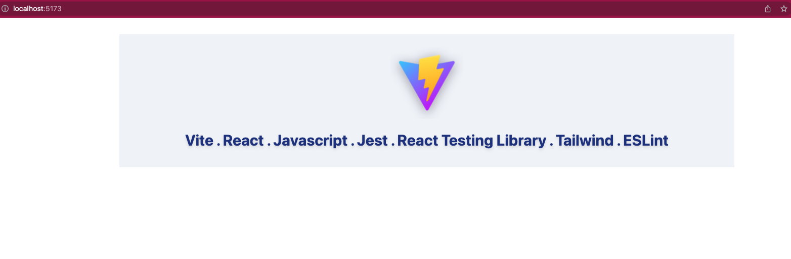

The following were used in varying degrees making this:  
[React + TailwindCSS + Vite.js = a Match made in Heaven?](https://dev.to/rjzauner/react-tailwindcss-vite-js-a-match-made-in-heaven-14o5)  
[Quick Jest Setup With ViteJS, React, & TypeScript](https://codingwithmanny.medium.com/quick-jest-setup-with-vitejs-react-typescript-82f325e4323f)  
[reactjs-vite-tailwindcss-boilerplate github repo](https://github.com/joaopaulomoraes/reactjs-vite-tailwindcss-boilerplate)

The main difference here is Javascript, rather than typescript.

After installs:
`npm run dev` shows:




And `npm test` resuts:


 ```javascript
 PASS  src/__tests__/App.test.js
  ✓ Vitejs should be in the doc (34 ms)

----------|---------|----------|---------|---------|-------------------
File      | % Stmts | % Branch | % Funcs | % Lines | Uncovered Line #s 
----------|---------|----------|---------|---------|-------------------
All files |   66.66 |      100 |     100 |   66.66 |                   
 App.jsx  |     100 |      100 |     100 |     100 |                   
 main.jsx |       0 |      100 |     100 |       0 | 6                 
----------|---------|----------|---------|---------|-------------------
Test Suites: 1 passed, 1 total
Tests:       1 passed, 1 total
Snapshots:   0 total
Time:        3.298 s
Ran all test suites related to changed files.

Watch Usage
 › Press a to run all tests.
 › Press f to run only failed tests.
 › Press q to quit watch mode.
 › Press p to filter by a filename regex pattern.
 › Press t to filter by a test name regex pattern.
 › Press Enter to trigger a test run.
  ```
  
Please let me know if anything doesn't work!